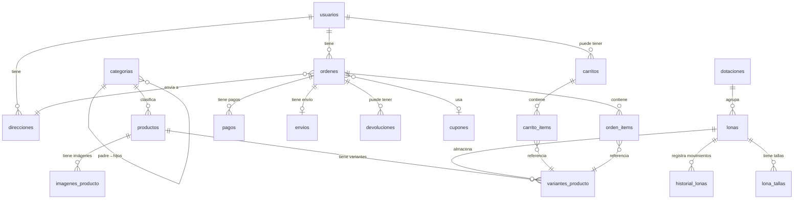

# 📦 Ecommerce Dotaciones — Documentación Técnica Completa

> **Proyecto:** D-Gala / Ecommerce Dotaciones  
> **Tipo:** Plataforma e-commerce B2B/B2C para dotaciones industriales y prendas de trabajo  
> **Generado:** Junio 2026 — análisis exhaustivo de cada archivo del repositorio

---

## FASE 1 — VISIÓN GENERAL DEL PROYECTO

### 1.1 ¿Qué es esta aplicación?

**Ecommerce Dotaciones** es una plataforma de comercio electrónico diseñada para la venta de dotaciones industriales (uniformes, camisetas, overoles, pantalones de trabajo, etc.) tanto para clientes minoristas como mayoristas. El sistema gestiona un flujo completo de e-commerce:

- **Catálogo de productos** con variantes (color, talla), imágenes múltiples y categorías jerárquicas
- **Sistema de lonas** — un concepto de inventario físico único donde las prendas se organizan en "lonas" (contenedores/lotes de ropa), cada una asociada a una "dotación"
- **Carrito de compras** con soporte para usuarios anónimos (por `session_id`)
- **Procesamiento de órdenes** con cupones de descuento, cálculo automático de envío y stock en tiempo real
- **Pagos integrados** con PayPal (sandbox/producción)
- **Panel de administración** (dashboard) separado para gestión completa del sistema
- **Notificaciones** automáticas de stock bajo y nuevas órdenes
- **Correos transaccionales** (verificación de cuenta, recuperación de contraseña, confirmación de compra)

### 1.2 Arquitectura General

```
┌─────────────────────────────────────────────────────────────────┐
│                    ARQUITECTURA DEL SISTEMA                     │
├─────────────────────────────────────────────────────────────────┤
│                                                                 │
│   ┌──────────────┐    ┌──────────────┐    ┌──────────────────┐ │
│   │   Frontend    │    │  Dashboard   │    │    Backend       │ │
│   │  (Vue.js)     │    │  (Vue.js)    │    │    (Laravel)     │ │
│   │  :5173        │    │  :5174       │    │    :8000         │ │
│   └──────┬───────┘    └──────┬───────┘    └──────┬───────────┘ │
│          │                    │                    │             │
│          └────────────────────┴──────► REST API ◄─┘             │
│                                           │                     │
│                                    ┌──────┴──────┐              │
│                                    │   MySQL     │              │
│                                    │  (MariaDB)  │              │
│                                    └─────────────┘              │
└─────────────────────────────────────────────────────────────────┘
```

**Tipo:** Aplicación **decoupled SPA** — tres aplicaciones independientes:
1. **Backend (Laravel 12)** — API REST pura, sirve JSON
2. **Frontend (Vue 3)** — Tienda pública para clientes, puerto `:5173`
3. **Dashboard (Vue 3)** — Panel administrativo, puerto `:5174`

Comunicación exclusiva vía **REST API** con autenticación **Bearer Token (Sanctum)**.

### 1.3 Stack Tecnológico

| Capa | Tecnología | Versión |
|------|-----------|---------|
| Backend Framework | Laravel | 12.x |
| Lenguaje Backend | PHP | ≥ 8.2 |
| Base de Datos | MySQL (MariaDB) | 10.4.32 |
| ORM | Eloquent | (incluido en Laravel) |
| Autenticación API | Laravel Sanctum | 4.3.x |
| Frontend Framework | Vue.js | 3.5.x |
| Router Frontend | Vue Router | 4.6.x |
| State Management (Frontend) | Pinia | 2.3.x |
| State Management (Dashboard) | Reactive Store (custom) | N/A |
| HTTP Client | Axios | 1.17.x |
| Bundler | Vite | 7.x / 8.x |
| Pagos | PayPal REST API v2 | Sandbox |
| Email | SMTP (Gmail) | N/A |
| Containerización | Docker / Docker Compose | 3.9 |
| Servidor Local | XAMPP (Apache + MySQL) | N/A |

### 1.4 Alcance del Proyecto

Se trata de un **sistema e-commerce multi-módulo empresarial** de alcance medio-alto. No es un simple CRUD — incluye:
- Gestión de inventario bidireccional (variantes ↔ lonas)
- Triggers MySQL para control de stock automático
- Sistema de notificaciones por eventos
- Integración con pasarela de pagos (PayPal)
- Emails transaccionales HTML diseñados
- Dashboard administrativo completo con métricas
- Sistema de cupones con validación completa
- Gestión de devoluciones con flujo de estados
- Verificación de email con enlaces firmados temporales

---

## FASE 2 — ESTRUCTURA DE DIRECTORIOS

```
ecommerce-dotaciones/
├── ecommerce-dotaciones/           # Raíz del proyecto
│   ├── backend/                    # API Laravel (PHP)
│   │   ├── app/
│   │   │   ├── Http/
│   │   │   │   ├── Controllers/
│   │   │   │   │   ├── Api/                          # Controladores de API pura
│   │   │   │   │   │   ├── AuthController.php         # Registro, login, perfil, password reset
│   │   │   │   │   │   ├── ContactoController.php     # Formulario de contacto
│   │   │   │   │   │   ├── DevolucionController.php   # Gestión de devoluciones
│   │   │   │   │   │   ├── EnvioController.php        # Gestión de envíos y tracking
│   │   │   │   │   │   ├── ImagenProductoController.php # CRUD imágenes de productos
│   │   │   │   │   │   ├── PagoController.php         # Registro y gestión de pagos
│   │   │   │   │   │   ├── PayPalController.php       # Integración PayPal
│   │   │   │   │   │   ├── ProductController.php      # CRUD productos
│   │   │   │   │   │   └── UsuarioController.php      # Gestión de usuarios (admin)
│   │   │   │   │   ├── CarritoController.php          # Carrito de compras
│   │   │   │   │   ├── CategoriaController.php        # CRUD categorías
│   │   │   │   │   ├── Controller.php                 # Base controller
│   │   │   │   │   ├── CuponController.php            # CRUD y validación de cupones
│   │   │   │   │   ├── DashboardController.php        # Métricas del dashboard
│   │   │   │   │   ├── DireccionController.php        # CRUD direcciones de envío
│   │   │   │   │   ├── DotacionController.php         # CRUD dotaciones
│   │   │   │   │   ├── HistorialLonaController.php    # Historial de movimientos
│   │   │   │   │   ├── LonaController.php             # CRUD lonas + ajuste stock
│   │   │   │   │   ├── LonaTallaController.php        # CRUD tallas por lona
│   │   │   │   │   ├── NotificacionController.php     # Notificaciones del sistema
│   │   │   │   │   ├── OrdenController.php            # Crear ordenes, listar, estados
│   │   │   │   │   └── VarianteProductoController.php # CRUD variantes de producto
│   │   │   │   ├── Middleware/
│   │   │   │   │   └── RoleMiddleware.php             # Control de acceso por rol
│   │   │   │   └── Requests/
│   │   │   │       └── StoreDevolucionRequest.php     # Form Request devolución
│   │   │   ├── Mail/
│   │   │   │   └── OrderConfirmation.php              # Mailable de confirmación
│   │   │   ├── Models/                                # 20 modelos Eloquent
│   │   │   │   ├── Carrito.php
│   │   │   │   ├── CarritoItem.php
│   │   │   │   ├── Categoria.php
│   │   │   │   ├── Contacto.php
│   │   │   │   ├── Cupon.php
│   │   │   │   ├── Devolucion.php
│   │   │   │   ├── Direccion.php
│   │   │   │   ├── Dotacion.php
│   │   │   │   ├── Envio.php
│   │   │   │   ├── HistorialLona.php
│   │   │   │   ├── ImagenProducto.php
│   │   │   │   ├── Lona.php
│   │   │   │   ├── LonaTalla.php
│   │   │   │   ├── Notificacion.php
│   │   │   │   ├── Orden.php
│   │   │   │   ├── OrdenItem.php
│   │   │   │   ├── Pago.php
│   │   │   │   ├── Productos.php
│   │   │   │   ├── Usuario.php
│   │   │   │   └── VarianteProducto.php
│   │   │   ├── Providers/
│   │   │   │   └── AppServiceProvider.php
│   │   │   └── Services/
│   │   │       └── PayPalService.php                  # Servicio de integración PayPal
│   │   ├── config/                                    # Configuración Laravel
│   │   │   ├── auth.php, cors.php, database.php
│   │   │   ├── mercadopago.php                        # Config MercadoPago (futuro)
│   │   │   └── sanctum.php
│   │   ├── database/
│   │   │   ├── ecommerce.sql                          # Dump completo de la BD
│   │   │   ├── database.sqlite                        # SQLite de desarrollo
│   │   │   ├── migrations/                            # 13 archivos de migración
│   │   │   └── seeders/
│   │   │       └── DatabaseSeeder.php
│   │   ├── routes/
│   │   │   ├── api.php                                # ~186 líneas, todas las rutas API
│   │   │   ├── web.php                                # Solo ruta raíz (welcome)
│   │   │   └── console.php
│   │   ├── public/
│   │   │   └── images/                                # Imágenes subidas (productos, categorías)
│   │   ├── resources/                                 # Blade views, CSS, JS
│   │   ├── Dockerfile                                 # PHP 8.2-cli con MySQL
│   │   ├── composer.json
│   │   ├── package.json
│   │   └── vite.config.js
│   │
│   ├── frontend/                    # Tienda Vue.js (cliente)
│   │   ├── src/
│   │   │   ├── App.vue                                # Shell principal
│   │   │   ├── main.js                                # Entry point con Pinia y Router
│   │   │   ├── cartState.js                           # Estado reactivo del carrito
│   │   │   ├── style.css                              # Estilos globales
│   │   │   ├── assets/
│   │   │   │   ├── css/animations.css                 # Animaciones CSS (reveal)
│   │   │   │   ├── theme.css, home.css
│   │   │   │   └── hero.png, vite.svg, vue.svg
│   │   │   ├── components/
│   │   │   │   ├── Navbar.vue                         # Barra de navegación
│   │   │   │   ├── Footer.vue                         # Pie de página
│   │   │   │   └── HelloWorld.vue                     # Componente demo (no usado)
│   │   │   ├── directives/
│   │   │   │   └── v-reveal.js                        # Directiva IntersectionObserver
│   │   │   ├── router/
│   │   │   │   └── index.js                           # 12 rutas de la tienda
│   │   │   └── views/                                 # 12 vistas de página
│   │   │       ├── Home.vue, About.vue, products.vue
│   │   │       ├── ProductDetail.vue, cart.vue, checkout.vue
│   │   │       ├── login.vue, ForgotPassword.vue, ResetPassword.vue
│   │   │       ├── contact.vue, MyAccount.vue, MisPedidos.vue
│   │   ├── .env                                       # VITE_PAYPAL_CLIENT_ID
│   │   ├── package.json
│   │   └── vite.config.js                             # Puerto 5173
│   │
│   ├── dashboard/                   # Panel Admin Vue.js
│   │   ├── src/
│   │   │   ├── App.vue                                # Layout con sidebar + header
│   │   │   ├── main.js                                # Entry point con interceptors Axios
│   │   │   ├── style.css                              # Estilos globales dashboard
│   │   │   ├── components/
│   │   │   │   ├── AppSidebar.vue                     # Sidebar de navegación
│   │   │   │   ├── AppHeader.vue                      # Header con notificaciones
│   │   │   │   └── HelloWorld.vue
│   │   │   ├── router/
│   │   │   │   └── index.js                           # 7 rutas con guard de rol
│   │   │   ├── store/
│   │   │   │   └── state.js                           # Store reactivo con localStorage
│   │   │   └── views/                                 # 7 vistas admin
│   │   │       ├── Overview.vue                       # Dashboard principal (métricas)
│   │   │       ├── Products.vue                       # Gestión de productos
│   │   │       ├── Orders.vue                         # Gestión de órdenes
│   │   │       ├── Dotaciones.vue                     # Gestión de dotaciones/lonas
│   │   │       ├── Categorias.vue                     # Gestión de categorías
│   │   │       ├── Users.vue                          # Gestión de usuarios
│   │   │       └── AdminAccount.vue                   # Cuenta del administrador
│   │   ├── package.json
│   │   └── vite.config.js                             # Puerto 5174
│   │
│   └── docker/
│       └── docker-compose.yml                         # Laravel + MySQL + phpMyAdmin
```

---

## FASE 3 — BACKEND (LARAVEL / PHP) ANÁLISIS PROFUNDO

### 3.1 Rutas (Routing)

#### `routes/api.php` — Todas las rutas API (186 líneas)

##### Rutas Públicas (sin autenticación)

| Método | URI | Controlador | Acción |
|--------|-----|-------------|--------|
| `GET` | `/api/productos` | `ProductController@index` | Listar todos los productos |
| `POST` | `/api/productos` | `ProductController@store` | Crear producto |
| `GET` | `/api/productos/{id}` | `ProductController@show` | Ver detalle de producto |
| `PUT` | `/api/productos/{id}` | `ProductController@update` | Actualizar producto |
| `DELETE` | `/api/productos/{id}` | `ProductController@destroy` | Eliminar producto (soft) |
| `GET` | `/api/cupones` | `CuponController@index` | Listar cupones |
| `POST` | `/api/cupones` | `CuponController@store` | Crear cupón |
| `GET` | `/api/cupones/{id}` | `CuponController@show` | Ver cupón |
| `PUT` | `/api/cupones/{id}` | `CuponController@update` | Actualizar cupón |
| `DELETE` | `/api/cupones/{id}` | `CuponController@destroy` | Eliminar cupón |
| `POST` | `/api/cupones/validar` | `CuponController@validar` | Validar cupón con subtotal |
| `POST` | `/api/cupones/aplicar` | `CuponController@aplicar` | Aplicar cupón a carrito |
| `GET` | `/api/variantes` | `VarianteProductoController@index` | Listar variantes |
| `POST` | `/api/variantes` | `VarianteProductoController@store` | Crear variante |
| `PUT` | `/api/variantes/{id}` | `VarianteProductoController@update` | Actualizar variante |
| `DELETE` | `/api/variantes/{id}` | `VarianteProductoController@destroy` | Eliminar variante (soft) |
| `GET` | `/api/productos/{id}/imagenes` | `ImagenProductoController@index` | Listar imágenes |
| `POST` | `/api/imagenes` | `ImagenProductoController@store` | Subir imagen |
| `PUT` | `/api/imagenes/{id}` | `ImagenProductoController@update` | Actualizar imagen |
| `PUT` | `/api/imagenes/{id}/portada` | `ImagenProductoController@setPortada` | Marcar como portada |
| `PUT` | `/api/productos/{id}/imagenes/reorder` | `ImagenProductoController@reorder` | Reordenar imágenes |
| `DELETE` | `/api/imagenes/{id}` | `ImagenProductoController@destroy` | Eliminar imagen |
| `GET` | `/api/categorias` | `CategoriaController@index` | Listar categorías (árbol) |
| `POST` | `/api/categorias` | `CategoriaController@store` | Crear categoría |
| `GET` | `/api/categorias/{id}` | `CategoriaController@show` | Ver categoría |
| `PUT` | `/api/categorias/{id}` | `CategoriaController@update` | Actualizar categoría |
| `POST` | `/api/categorias/{id}/imagen` | `CategoriaController@uploadImagen` | Subir imagen categoría |
| `DELETE` | `/api/categorias/{id}` | `CategoriaController@destroy` | Eliminar categoría |
| `GET/POST/PUT/DELETE` | `/api/dotaciones[/{id}]` | `DotacionController` | CRUD dotaciones |
| `GET/POST/PUT/DELETE` | `/api/lonas[/{id}]` | `LonaController` | CRUD lonas |
| `POST` | `/api/lonas/{id}/ajustar-stock` | `LonaController@ajustarStock` | Ajuste manual de stock |
| `GET/POST/PUT/DELETE` | `/api/lona-tallas[/{id}]` | `LonaTallaController` | CRUD tallas de lona |
| `GET/POST` | `/api/historial-lonas` | `HistorialLonaController` | Historial de movimientos |
| `POST` | `/api/carritos` | `CarritoController@store` | Crear carrito |
| `POST` | `/api/carritos/{id}/items` | `CarritoController@agregarItem` | Agregar item |
| `GET` | `/api/carritos/{id}` | `CarritoController@show` | Ver carrito |
| `PUT` | `/api/carrito-items/{id}` | `CarritoController@updateItem` | Actualizar cantidad |
| `DELETE` | `/api/carrito-items/{id}` | `CarritoController@destroyItem` | Eliminar item |
| `DELETE` | `/api/carritos/{id}/vaciar` | `CarritoController@vaciar` | Vaciar carrito |
| `POST` | `/api/register` | `AuthController@register` | Registro de usuario |
| `POST` | `/api/login` | `AuthController@login` | Inicio de sesión |
| `POST` | `/api/forgot-password` | `AuthController@forgotPassword` | Solicitar reset password |
| `POST` | `/api/reset-password` | `AuthController@resetPassword` | Restablecer contraseña |
| `GET` | `/api/verify-email/{id}` | `AuthController@verifyEmail` | Verificar email (signed) |
| `POST` | `/api/resend-verification` | `AuthController@resendVerification` | Reenviar verificación |
| `POST` | `/api/contactos` | `ContactoController@store` | Enviar mensaje contacto |
| `POST` | `/api/paypal/webhook` | `PayPalController@webhook` | Webhook PayPal (público) |
| `GET` | `/api/test` | (closure) | Health check |

##### Rutas Protegidas (`auth:sanctum`)

| Método | URI | Controlador | Acción |
|--------|-----|-------------|--------|
| `POST` | `/api/ordenes/crear` | `OrdenController@crearDesdeCarrito` | Crear orden desde carrito |
| `GET` | `/api/mis-pedidos` | `OrdenController@misPedidos` | Pedidos del usuario |
| `GET` | `/api/ordenes/{id}` | `OrdenController@show` | Detalle de orden |
| `PUT` | `/api/ordenes/{id}/cancelar` | `OrdenController@cancelar` | Cancelar orden |
| `GET/POST/PUT/DELETE` | `/api/direcciones[/{id}]` | `DireccionController` | CRUD direcciones |
| `POST` | `/api/paypal/create-order` | `PayPalController@createOrder` | Crear orden PayPal |
| `POST` | `/api/paypal/capture-order` | `PayPalController@captureOrder` | Capturar pago PayPal |
| `GET` | `/api/profile` | `AuthController@profile` | Obtener perfil |
| `PUT` | `/api/profile` | `AuthController@updateProfile` | Actualizar perfil |
| `DELETE` | `/api/profile` | `AuthController@deleteProfile` | Eliminar cuenta |
| `POST` | `/api/logout` | `AuthController@logout` | Cerrar sesión |

##### Rutas Admin (sin middleware explícito de rol — expuestas)

| Método | URI | Controlador | Acción |
|--------|-----|-------------|--------|
| `GET` | `/api/ordenes` | `OrdenController@index` | Listar todas las órdenes |
| `PUT` | `/api/ordenes/{id}/estado` | `OrdenController@cambiarEstado` | Cambiar estado orden |
| `GET/POST/PUT` | `/api/pagos[/{id}]` | `PagoController` | CRUD pagos |
| `PUT` | `/api/pagos/{id}/aprobar` | `PagoController@aprobar` | Aprobar pago |
| `PUT` | `/api/pagos/{id}/rechazar` | `PagoController@rechazar` | Rechazar pago |
| `PUT` | `/api/pagos/{id}/reembolso` | `PagoController@reembolso` | Reembolsar pago |
| `GET/POST/PUT` | `/api/envios[/{id}]` | `EnvioController` | CRUD envíos |
| `GET` | `/api/tracking/{guia}` | `EnvioController@tracking` | Tracking por guía |
| `GET/POST/PUT` | `/api/devoluciones[/{id}]` | `DevolucionController` | CRUD devoluciones |
| `GET/POST/PUT` | `/api/notificaciones[/{id}]` | `NotificacionController` | Notificaciones |
| `GET` | `/api/dashboard/resumen` | `DashboardController@resumen` | Métricas admin |
| `GET/POST/PUT/DELETE` | `/api/usuarios[/{id}]` | `UsuarioController` | CRUD usuarios |

> [!WARNING]
> **Inconsistencia de seguridad:** Las rutas de administración (ordenes, pagos, envíos, devoluciones, usuarios, dashboard) **no tienen middleware `auth:sanctum`** ni `role:admin` en `api.php`. La protección se implementa solo del lado del frontend (dashboard router guard). Esto representa una vulnerabilidad significativa.

#### `routes/web.php`

Solo contiene una ruta raíz que retorna la vista `welcome` de Laravel.

---

### 3.2 Controladores

Se resumen los 22 controladores principales (9 en `Api/` y 13 en la raíz):

#### `AuthController` — Autenticación completa
- **`register()`** — Crea usuario con rol `cliente`, envía email de verificación con enlace firmado (24h)
- **`login()`** — Busca por email O nombre, verifica contraseña con Hash::check, valida email verificado, genera token Sanctum
- **`verifyEmail()`** — Valida firma del URL, marca `email_verificado_en`, redirige a frontend
- **`resendVerification()`** — Reenvía email de verificación
- **`profile()`** — Retorna `$request->user()`
- **`updateProfile()`** — Actualiza nombre, email, teléfono, password. Si cambia email, requiere nueva verificación
- **`deleteProfile()`** — Revoca todos los tokens y elimina el usuario
- **`logout()`** — Elimina el token actual
- **`forgotPassword()`** — Genera token aleatorio, lo guarda en `password_reset_tokens`, envía email HTML con enlace
- **`resetPassword()`** — Valida token, actualiza contraseña, elimina token

#### `OrdenController` — Gestión de órdenes (el más complejo, 426 líneas)
- **`crearDesdeCarrito()`** — Dentro de `DB::beginTransaction()`: valida stock en `lona_tallas`, calcula precios con descuento por variante, aplica cupón, calcula envío (gratis si subtotal > $200,000 COP), crea orden + items, vacía carrito, crea notificación admin, verifica stock bajo post-venta
- **`misPedidos()`** — Lista órdenes del usuario autenticado con eager loading completo
- **`index()`** — Lista todas las órdenes (admin)
- **`show()`** — Detalle con verificación de propiedad (clientes solo ven las suyas)
- **`cambiarEstado()`** — Acepta: pendiente, pagado, confirmada, procesando, enviado, entregado, cancelada, devuelta
- **`cancelar()`** — Marca como cancelada
- **`enviarCorreoConfirmacion()`** (estático) — Genera HTML elaborado con tabla de productos, resumen financiero y enlace a "mis pedidos"

#### `PayPalController` — Integración PayPal
- **`createOrder()`** — Convierte COP→USD con tasa configurable, crea orden en PayPal v2
- **`captureOrder()`** — Captura pago, registra en tabla `pagos`, marca orden como `pagado`, envía email de confirmación
- **`webhook()`** — Procesa eventos `CHECKOUT.ORDER.APPROVED` y `PAYMENT.CAPTURE.COMPLETED`, verifica firma si `PAYPAL_WEBHOOK_ID` está configurado

*(Todos los demás controladores siguen patrones CRUD estándar documentados en la sección de rutas)*

---

### 3.3 Modelos (Eloquent ORM)

| Modelo | Tabla | `$fillable` | Relaciones | Especial |
|--------|-------|-------------|------------|----------|
| **Usuario** | `usuarios` | nombre, email, password, telefono, rol | — | `HasApiTokens`, `SoftDeletes` implícito, `$hidden`: password/remember_token, `$casts`: email_verificado_en→datetime, password→hashed |
| **Productos** | `productos` | nombre, slug, descripcion, precio_minorista, precio_mayorista, min_cantidad_mayorista, publicado, categoria_id, destacado | `hasMany(VarianteProducto)`, `belongsTo(Categoria)`, `hasMany(ImagenProducto)` | `SoftDeletes` con `DELETED_AT='eliminado_en'` |
| **VarianteProducto** | `variantes_producto` | producto_id, lona_id, sku, color, color_hex, talla, stock, precio_extra, descuento | `belongsTo(Productos)`, `belongsTo(Lona)` | `SoftDeletes` con `DELETED_AT='eliminado_en'` |
| **Categoria** | `categorias` | nombre, slug, padre_id, orden, destacada, imagen_url | `belongsTo(Categoria, 'padre_id')` (self-ref padre), `hasMany(Categoria, 'padre_id')` (hijos recursivos) | Categorías jerárquicas con `with('hijos')` recursivo |
| **Orden** | `ordenes` | usuario_id, direccion_id, cupon_id, numero, estado, tipo_precio, subtotal, descuento, envio_costo, total, notas_cliente | `belongsTo(Usuario)`, `belongsTo(Direccion)`, `belongsTo(Cupon)`, `hasMany(OrdenItem)`, `hasMany(Pago)`, `hasOne(Envio)`, `hasMany(Devolucion)` | `$casts` para valores decimales |
| **OrdenItem** | `orden_items` | orden_id, variante_id, lona_id_snapshot, cantidad, precio_unitario, total_linea | `belongsTo(Orden)`, `belongsTo(VarianteProducto)` | `lona_id_snapshot` guarda referencia de lona al momento de la compra |
| **Carrito** | `carritos` | usuario_id, session_id, cupon_id | `hasMany(CarritoItem)` | Soporta usuarios anónimos via `session_id` |
| **CarritoItem** | `carrito_items` | carrito_id, variante_id, lona_id, cantidad | `belongsTo(VarianteProducto)` | — |
| **Dotacion** | `dotaciones` | nombre, descripcion, min_lonas, max_lonas, lonas_activas, alerta_enviada_en | `hasMany(Lona)` | Concepto de agrupación de lonas |
| **Lona** | `lonas` | dotacion_id, codigo, tipo_producto, categoria_id, estado, activa, capacidad_maxima | `belongsTo(Dotacion)`, `belongsTo(Categoria)`, `hasMany(LonaTalla)` | Estado: nuevo/usado. Capacidad máxima configurable |
| **LonaTalla** | `lona_tallas` | lona_id, talla, cantidad | — | Inventario real por talla dentro de una lona |
| **HistorialLona** | `historial_lonas` | lona_id, orden_item_id, accion, talla, cantidad_cambio, cantidad_restante, snapshot_json, notas, creado_por, creado_en | `belongsTo(Lona)` | `$casts`: snapshot_json→array. Registro de auditoría |
| **ImagenProducto** | `imagenes_producto` | producto_id, variante_id, url, es_portada, orden | `belongsTo(Productos)`, `belongsTo(VarianteProducto)` | Soporte multi-imagen con portada y orden |
| **Pago** | `pagos` | orden_id, metodo, referencia_pasarela, estado, monto, pagado_en | `belongsTo(Orden)` | Estados: pendiente, aprobado, rechazado, reembolsado |
| **Envio** | `envios` | orden_id, transportadora, guia, estado, fecha_entrega_estimada, entregado_en | `belongsTo(Orden)` | Estados: preparando, enviado, en_ruta, entregado, fallido |
| **Devolucion** | `devoluciones` | orden_id, motivo, estado, resolucion_admin, resuelto_por | `belongsTo(Orden)` | Estados: pendiente, aprobada, rechazada, resuelta |
| **Cupon** | `cupones` | codigo, tipo, valor, monto_minimo_pedido, limite_usos, usos_actuales, activo, expira_en | — | Tipo: porcentaje/fijo |
| **Direccion** | `direcciones` | usuario_id, nombre_recibe, telefono, etiqueta, departamento, ciudad, direccion, referencia, codigo_postal, es_principal | — | — |
| **Notificacion** | `notificaciones` | usuario_id, tipo, titulo, mensaje, leido_en, confirmado_por | — | `CREATED_AT='creado_en'`, `UPDATED_AT=null`. Tipos: stock_bajo, orden, sistema, marketing |
| **Contacto** | `contactos` | first_name, last_name, email, subject, message, status | — | Usa timestamps estándar de Laravel |

---

### 3.4 Esquema de Base de Datos (desde `ecommerce.sql`)

#### Diagrama Entidad-Relación (textual)



#### Tablas principales con columnas

La base de datos contiene **22 tablas** incluyendo: `usuarios`, `productos`, `variantes_producto`, `categorias`, `dotaciones`, `lonas`, `lona_tallas`, `historial_lonas`, `imagenes_producto`, `ordenes`, `orden_items`, `carritos`, `carrito_items`, `pagos`, `envios`, `devoluciones`, `cupones`, `direcciones`, `notificaciones`, `contactos`, `password_reset_tokens`, `personal_access_tokens`, `sessions`, `banners`, `configuraciones_cms`, `jobs`, `job_batches`, `cache`, `cache_locks`, `migrations`.

#### Trigger MySQL Crítico

```sql
-- trg_descuento_stock_venta: BEFORE INSERT en orden_items
-- 1. Obtiene lona_id y talla de la variante
-- 2. Valida que exista lona asociada
-- 3. Valida stock en lona_tallas
-- 4. Descuenta stock en lona_tallas
-- 5. Descuenta stock en variantes_producto  
-- 6. Registra en historial_lonas (auditoría)
```

> [!IMPORTANT]
> El trigger `trg_descuento_stock_venta` opera a nivel de base de datos, proporcionando una segunda capa de validación de stock además de la validación en `OrdenController@crearDesdeCarrito`. Esto genera una **doble deducción de stock** — el controller valida pero no deduce, y el trigger deduce automáticamente al insertar en `orden_items`.

---

### 3.5 Middleware

| Middleware | Archivo | Función |
|-----------|---------|---------|
| **RoleMiddleware** | `app/Http/Middleware/RoleMiddleware.php` | Verifica que `$request->user()->rol` coincida con el rol requerido. Retorna 401 si no autenticado, 403 si rol incorrecto |
| **auth:sanctum** | (Laravel Sanctum built-in) | Valida token Bearer en headers |

> [!NOTE]
> `RoleMiddleware` está definido pero **no está aplicado en ninguna ruta** en `api.php`. La protección de rol se realiza solo en el frontend (dashboard router guard).

---

### 3.6 Form Requests

| Clase | Reglas |
|-------|--------|
| **StoreDevolucionRequest** | `orden_id`: required, exists:ordenes,id. `motivo`: required, string, min:10. `authorize()` retorna `true` |

---

### 3.7 Servicio de Negocio

#### `PayPalService`
- **Responsabilidad:** Encapsular toda la comunicación HTTP con la API PayPal v2
- **Métodos:**
  - `getAccessToken()` — Autenticación OAuth2 client_credentials
  - `createOrder($amount, $currency, $referenceId)` — Crea orden con intent CAPTURE
  - `capturePayment($orderId)` — Captura pago de orden aprobada
  - `verifyWebhookSignature($headers, $body)` — Verifica firma HMAC del webhook
- **Configuración:** Lee `PAYPAL_CLIENT_ID`, `PAYPAL_SECRET`, `PAYPAL_MODE` directamente de `env()`
- **URLs:** Sandbox: `api-m.sandbox.paypal.com`, Producción: `api-m.paypal.com`

---

### 3.8 Autenticación y Autorización

| Aspecto | Implementación |
|---------|---------------|
| **Mecanismo** | Laravel Sanctum — tokens Bearer en header `Authorization` |
| **Emisión de token** | En `login()` vía `$user->createToken('auth_token')->plainTextToken` |
| **Almacenamiento server** | Tabla `personal_access_tokens` |
| **Expiración** | Sin expiración configurada (`sanctum.expiration = null`) |
| **Roles** | Campo `rol` en tabla `usuarios`: `cliente`, `admin`, `super_admin` |
| **Enforcement de rol** | Solo en frontend (dashboard `beforeEach` guard). **No en backend** |
| **Verificación de email** | URLs firmadas temporales (24h) vía `URL::temporarySignedRoute()` |
| **Guard por defecto** | `web` (session) — Sanctum usa Bearer para API |
| **Provider** | Eloquent con modelo `Usuario` |
| **Password hashing** | bcrypt con 12 rounds |

---

### 3.9 Configuración

| Archivo | Detalles Clave |
|---------|---------------|
| `config/auth.php` | Guard: `web`/session. Provider: eloquent con `Usuario::class`. Password reset: tabla `password_reset_tokens`, expira en 60min, throttle 60s |
| `config/cors.php` | Paths: `api/*`, `sanctum/csrf-cookie`. Origins: `localhost:5173`, `localhost:5174`, `127.0.0.1:5173`, `127.0.0.1:5174`. Credentials: `true` |
| `config/sanctum.php` | Stateful domains: localhost + varios. Guard: `web`. Sin expiración de token |
| `config/mercadopago.php` | `public_key`, `access_token`, `webhook_secret` desde env. **No implementado** — rutas comentadas |
| `config/database.php` | Estándar Laravel. Conexión por defecto: `mysql` |

---

### 3.10 Variables de Entorno (`.env`)

| Variable | Valor / Descripción |
|----------|-------------------|
| `APP_URL` | `http://localhost:8000` |
| `DB_CONNECTION` | `mysql` |
| `DB_DATABASE` | `ecommerce` |
| `DB_USERNAME/PASSWORD` | `root` / (vacío) |
| `SESSION_DRIVER` | `database` |
| `QUEUE_CONNECTION` | `database` |
| `CACHE_STORE` | `database` |
| `MAIL_MAILER` | `smtp` (Gmail SSL:465) |
| `MAIL_FROM_NAME` | "Ecommerce Dotaciones" |
| `FRONTEND_URL` | `http://localhost:5173` |
| `PAYPAL_CLIENT_ID` | (sandbox key configurada) |
| `PAYPAL_SECRET` | (sandbox secret configurada) |
| `PAYPAL_MODE` | `sandbox` |
| `EXCHANGE_RATE_COP_USD` | `4000` |
| `BCRYPT_ROUNDS` | `12` |

---

## FASE 4 — FRONTEND (VUE.JS) ANÁLISIS PROFUNDO

### 4.1 Entry Point — Frontend (Tienda)

**Archivo:** `frontend/src/main.js`

```js
import { createApp } from 'vue'
import { createPinia } from 'pinia'
import router from './router'
import vReveal from './directives/v-reveal'

const app = createApp(App)
app.use(createPinia())       // State management
app.use(router)              // Vue Router
app.directive('reveal', vReveal) // Custom directive
app.mount('#app')
```

**Plugins:** Pinia, Vue Router, directiva `v-reveal` personalizada

### 4.2 Vue Router — Frontend

| Path | Nombre | Componente | Meta |
|------|--------|-----------|------|
| `/` | Home | `Home.vue` | — |
| `/products` | Products | `products.vue` | — |
| `/about` | About | `About.vue` | — |
| `/contact` | Contact | `contact.vue` | — |
| `/cart` | Cart | `cart.vue` | — |
| `/login` | Login | `login.vue` | `hideNavbar: true, hideFooter: true` |
| `/forgot-password` | ForgotPassword | `ForgotPassword.vue` | `hideNavbar: true, hideFooter: true` |
| `/reset-password` | ResetPassword | `ResetPassword.vue` | `hideNavbar: true, hideFooter: true` |
| `/checkout` | Checkout | `checkout.vue` | — |
| `/product/:id` | ProductDetail | `ProductDetail.vue` | — |
| `/my-account` | MyAccount | `MyAccount.vue` | — |
| `/mis-pedidos` | MisPedidos | `MisPedidos.vue` | — |

- **Mode:** `createWebHistory` (HTML5 History API)
- **Scroll behavior:** Restaura posición guardada o scroll al top
- **No hay lazy-loading** — todos los componentes se importan estáticamente
- **No hay guards de navegación** en el frontend de la tienda

### 4.3 Vue Router — Dashboard

| Path | Nombre | Componente |
|------|--------|-----------|
| `/` | Overview | `Overview.vue` |
| `/products` | Products | `Products.vue` |
| `/orders` | Orders | `Orders.vue` |
| `/dotaciones` | Dotaciones | `Dotaciones.vue` |
| `/users` | Users | `Users.vue` |
| `/account` | AdminAccount | `AdminAccount.vue` |
| `/categorias` | Categorias | `Categorias.vue` |

**Guard global (`beforeEach`):**
1. Verifica `localStorage.getItem('auth_user')`
2. Si no existe → redirige a `http://localhost:5173/login`
3. Parsea JSON del usuario, verifica `rol` contra `['admin', 'superadmin', 'super admin', 'super_admin']`
4. Si rol inválido → redirige a frontend home

### 4.4 State Management

#### Frontend — `cartState.js` (estado reactivo simple)
```js
export const cartItemCount = ref(0)
export const updateCartCount = async () => {
  // Lee carrito_id de localStorage
  // GET /api/carritos/{cartId}
  // Suma cantidades de items
}
```

#### Dashboard — `store/state.js` (store reactivo con persistencia)
- **Tipo:** `reactive()` de Vue 3 con `watch()` deep que persiste a `localStorage`
- **Estado:** usuarios, productos, variantes, ordenes, orden_items, dotaciones, lonas, lona_tallas, historial_lonas, notificaciones, envios, theme
- **Datos semilla:** Incluye datos de ejemplo pre-cargados desde la estructura del SQL
- **Actions:** `addProduct()`, `updateProduct()`, `deleteProduct()`, `addVariant()`, `updateVariant()`, `deleteVariant()`, `updateOrderStatus()`, `updateOrderShipping()`, `addDotacion()`, `addLona()`, `updateLona()`, `adjustLonaStock()`, `updateUserRole()`, `markNotificationRead()`, `clearNotifications()`, `toggleTheme()`

> [!NOTE]
> El dashboard store local (`state.js`) funciona como **capa de datos de demostración** con datos hardcoded. Los componentes del dashboard también realizan llamadas API reales al backend. Existe una **dualidad** entre datos locales del store y datos reales de la API.

### 4.5 API Integration

**Cliente HTTP:** Axios (directo, sin instancia centralizada)

**Patrón de llamadas:** Dispersas en cada componente Vue, usando URLs hardcodeadas:
```js
axios.get('http://localhost:8000/api/productos')
axios.post('http://localhost:8000/api/ordenes/crear', payload, {
  headers: { Authorization: `Bearer ${token}` }
})
```

**Token attachment:** Manual en cada llamada via header `Authorization: Bearer {token}`. El token se obtiene de `localStorage.getItem('auth_token')`.

**Interceptor global (solo dashboard):**
```js
axios.interceptors.response.use(response => response, error => {
  if (error.response?.status === 401) {
    localStorage.removeItem('auth_token')
    localStorage.removeItem('auth_user')
    window.location.href = 'http://localhost:5173/login'
  }
})
```

### 4.6 Directiva `v-reveal`

Custom Vue directive que usa `IntersectionObserver` para animar elementos al entrar en el viewport:
- Agrega clases CSS `reveal-base` + tipo de animación (`fade-up` por defecto)
- Al intersectar: agrega `is-revealed`
- Configurable: `threshold` (default 0.15), `rootMargin`, `animation`, `once` (default true)
- Cleanup en `unmounted` para evitar memory leaks

### 4.7 CSS y Estilos

- **Enfoque:** CSS vanilla personalizado (sin frameworks CSS)
- **Estilos globales:** `style.css` en cada app (frontend y dashboard)
- **Animaciones:** `animations.css` en frontend — clases `.reveal-base`, `.fade-up`, `.is-revealed`
- **Theme:** El dashboard soporta temas `light`/`dark` via clase en `document.documentElement`
- **No se usa** Tailwind, Bootstrap, ni ninguna librería de componentes UI

---

## FASE 5 — CONEXIÓN LARAVEL ↔ VUE.JS

### 5.1 Shell HTML inicial

- **Frontend:** `frontend/index.html` — HTML estático servido por Vite dev server
- **Dashboard:** `dashboard/index.html` — ídem, servido por Vite en puerto 5174
- **No se usa Blade** para servir las SPAs. Laravel sirve exclusivamente como API

### 5.2 Assets y Build

| App | Bundler | Comando Dev | Puerto | Producción |
|-----|---------|-------------|--------|------------|
| Backend | Vite + laravel-vite-plugin | `php artisan serve` | 8000 | `vite build` → `public/build/` |
| Frontend | Vite + @vitejs/plugin-vue | `npm run dev` | 5173 | `npm run build` → `dist/` |
| Dashboard | Vite + @vitejs/plugin-vue | `npm run dev` | 5174 | `npm run build` → `dist/` |

### 5.3 Flujo API End-to-End

#### Ejemplo: Crear Orden (POST)

```
1. Usuario en checkout.vue → llena formulario, click "Pagar"
2. Vue: axios.post('http://localhost:8000/api/ordenes/crear', {
     carrito_id, direccion_id, notas_cliente
   }, { headers: { Authorization: `Bearer ${token}` } })
3. Laravel: auth:sanctum middleware valida token
4. OrdenController@crearDesdeCarrito():
   a. DB::beginTransaction()
   b. Carrito::with('items.variante.producto')->findOrFail(carrito_id)
   c. Valida stock en lona_tallas para cada item
   d. Calcula subtotal con descuento por variante
   e. Aplica cupón si existe
   f. Calcula envío (gratis > $200,000)
   g. Orden::create([...])
   h. OrdenItem::create([...]) → TRIGGER MySQL descuenta stock
   i. Vacía carrito
   j. Crea notificación admin
   k. DB::commit()
5. Respuesta JSON: { message, data: orden_completa }
6. Vue: muestra confirmación, redirige a pago PayPal
```

### 5.4 Autenticación compartida

| Aspecto | Implementación |
|---------|---------------|
| **Almacenamiento del token** | `localStorage` bajo key `auth_token` |
| **Almacenamiento del usuario** | `localStorage` bajo key `auth_user` (JSON del objeto usuario) |
| **¿Cómo sabe Vue si está logueado?** | Verifica `localStorage.getItem('auth_token')` |
| **Redirección de no autenticados** | Dashboard: `beforeEach` guard redirige a login. Frontend: sin guard global |
| **Paso de auth al dashboard** | Via URL params: `?auth_user=...&auth_token=...`, el dashboard los extrae en `main.js` y los guarda en localStorage |

### 5.5 CORS

```php
'allowed_origins' => [
    'http://localhost:5173',   // Frontend
    'http://localhost:5174',   // Dashboard
    'http://127.0.0.1:5173',
    'http://127.0.0.1:5174'
],
'supports_credentials' => true,
'allowed_headers' => ['*'],
'allowed_methods' => ['*'],
```

---

## FASE 6 — OPERACIONES DE BASE DE DATOS

### CREATE (Inserciones)
- **Controladores que crean:** ProductController, VarianteProductoController, OrdenController, CarritoController, CategoriaController, CuponController, DotacionController, LonaController, DireccionController, etc.
- **Validación:** Siempre vía `$request->validate()` o Form Requests antes de insertar
- **Transacciones:** `DB::beginTransaction()` en `OrdenController@crearDesdeCarrito`, `LonaController@ajustarStock`, `PayPalController@captureOrder`
- **Eventos de modelo:** No se usan observers. El trigger MySQL actúa a nivel de BD

### READ (Consultas)
- **Eager Loading:** Extensivo. Ejemplo: `Orden::with(['items.variante.producto.imagenes', 'direccion', 'usuario', 'envio', 'pago'])`
- **Paginación:** No implementada — todas las consultas usan `->get()` sin límites
- **Raw SQL:** `DB::table('password_reset_tokens')` en AuthController, `DB::table('lona_tallas')` en OrdenController
- **Scopes:** No se definen query scopes personalizados

### UPDATE
- **PATCH vs PUT:** No diferenciados. Todos los updates usan `PUT`. El controller acepta campos parciales vía `sometimes` en validación
- **Mass Assignment:** Protegido por `$fillable` en todos los modelos

### DELETE
- **Soft Delete:** `Productos` y `VarianteProducto` usan `SoftDeletes` con `DELETED_AT='eliminado_en'`
- **Hard Delete:** Direcciones, cupones, categorías, usuarios, tallas
- **Cascade lógico:** `ProductController@destroy` elimina variantes antes del producto. `DotacionController` previene eliminación si tiene lonas. `CategoriaController` previene eliminación si tiene hijos

---

## FASE 7 — INTEGRACIONES EXTERNAS

### PayPal (REST API v2)
- **Servicio:** `app/Services/PayPalService.php`
- **Controller:** `app/Http/Controllers/Api/PayPalController.php`
- **Operaciones:** Crear orden, capturar pago, verificar webhook
- **Modo:** Sandbox (configurable a producción vía `PAYPAL_MODE`)
- **Moneda:** Conversión COP→USD con tasa configurable (`EXCHANGE_RATE_COP_USD=4000`)

### Email SMTP (Gmail)
- **Proveedor:** Gmail via SMTP (puerto 465, SSL)
- **Correos enviados:**
  1. Verificación de cuenta (enlace firmado 24h)
  2. Recuperación de contraseña (token + enlace al frontend)
  3. Confirmación de compra (HTML con tabla de productos y resumen)
  4. Activación de cuenta (cuando admin crea usuario)
- **Templates:** HTML inline en controladores (no usa Blade views para emails, excepto `OrderConfirmation` Mailable)

### MercadoPago (Preparado pero no implementado)
- Config file existe: `config/mercadopago.php`
- Paquete instalado: `mercadopago/dx-php: ^3.10`
- Rutas comentadas en `api.php`
- **Sin controlador implementado**

---

## FASE 8 — DEPENDENCIAS

### Backend — `composer.json`

| Paquete | Versión | Propósito |
|---------|---------|----------|
| `laravel/framework` | ^12.0 | Framework principal |
| `laravel/sanctum` | ^4.3 | Autenticación API por tokens |
| `laravel/tinker` | ^2.10.1 | REPL para depuración |
| `mercadopago/dx-php` | ^3.10 | SDK MercadoPago (instalado pero no usado) |

**Dev dependencies:** fakerphp/faker, laravel/pail, laravel/pint, laravel/sail, mockery, collision, phpunit, squizlabs/php_codesniffer

### Frontend — `package.json`

| Paquete | Versión | Propósito |
|---------|---------|----------|
| `vue` | ^3.5.34 | Framework UI |
| `vue-router` | ^4.6.4 | Routing SPA |
| `pinia` | ^2.3.1 | State management |
| `axios` | ^1.17.0 | Cliente HTTP |
| `@vitejs/plugin-vue` | ^6.0.6 | Plugin Vite para Vue |
| `vite` | ^8.0.12 | Bundler |

### Dashboard — `package.json`

| Paquete | Versión | Propósito |
|---------|---------|----------|
| `vue` | ^3.5.34 | Framework UI |
| `vue-router` | ^4.6.4 | Routing SPA |
| `axios` | ^1.17.0 | Cliente HTTP |
| `@vitejs/plugin-vue` | ^6.0.6 | Plugin Vite para Vue |
| `vite` | ^8.0.12 | Bundler |

> [!NOTE]
> El dashboard **no usa Pinia** — usa un store reactivo custom basado en `reactive()` + `watch()` con persistencia en localStorage.

### Backend Node — `package.json`

| Paquete | Versión | Propósito |
|---------|---------|----------|
| `laravel-vite-plugin` | ^2.0.0 | Integración Laravel+Vite |
| `@tailwindcss/vite` | ^4.0.0 | TailwindCSS plugin (instalado pero no usado en frontend Vue) |
| `tailwindcss` | ^4.0.0 | CSS framework (solo para assets Laravel) |
| `axios` | ^1.11.0 | HTTP client |
| `concurrently` | ^9.0.1 | Ejecutar múltiples procesos |
| `vite` | ^7.0.7 | Bundler |

---

## FASE 9 — CONSIDERACIONES DE SEGURIDAD

| Aspecto | Estado |
|---------|--------|
| **XSS** | `htmlspecialchars()` usado en emails HTML inline. Vue.js escapa por defecto con `{{ }}`. Sin `v-html` visible en los archivos analizados |
| **CSRF** | No aplicable para API (Sanctum usa tokens Bearer, no cookies CSRF). Validación CSRF configurada en Sanctum middleware pero no activada para API |
| **SQL Injection** | Eloquent ORM con queries parametrizadas. Raw queries usan `DB::table()` con bindings. Un caso de interpolación directa en trigger MySQL (seguro por diseño) |
| **Autenticación** | Sanctum tokens sin expiración (`expiration: null`). **Riesgo:** tokens válidos indefinidamente |
| **Autorización** | **Vulnerabilidad crítica:** Rutas admin sin middleware de autenticación ni rol en `api.php`. Cualquier usuario (o anónimo) puede acceder a `/api/ordenes`, `/api/usuarios`, `/api/dashboard/resumen`, etc. |
| **Rate Limiting** | No configurado en ninguna ruta |
| **Passwords** | Hashed con bcrypt (12 rounds) vía cast `'hashed'` en modelo Usuario |
| **Tokens** | Almacenados hasheados en `personal_access_tokens` (SHA-256) |
| **Credenciales expuestas** | `.env` contiene credenciales SMTP de Gmail y keys PayPal sandbox **en el repositorio** |
| **CORS** | Restringido a localhost:5173/5174. Adecuado para desarrollo, necesita actualización para producción |

> [!CAUTION]
> **Hallazgos de seguridad críticos:**
> 1. Las rutas de admin/gestión (órdenes, pagos, envíos, usuarios, dashboard) son **públicamente accesibles** sin autenticación
> 2. Tokens Sanctum no expiran
> 3. Credenciales de email y PayPal commiteadas al repositorio
> 4. Sin rate limiting en login/register (vulnerable a brute force)

---

## FASE 10 — CÓMO EJECUTAR EL PROYECTO

### Requisitos del Sistema

| Requisito | Versión |
|-----------|---------|
| PHP | ≥ 8.2 |
| Composer | ≥ 2.x |
| Node.js | ≥ 18.x (recomendado 20.x) |
| npm | ≥ 9.x |
| MySQL / MariaDB | ≥ 8.0 / ≥ 10.4 |
| XAMPP (opcional) | Con Apache + MySQL |

### Backend Setup

```bash
# 1. Clonar el repositorio
git clone <url-del-repositorio>
cd ecommerce-dotaciones/ecommerce-dotaciones/backend

# 2. Instalar dependencias PHP
composer install

# 3. Configurar entorno
cp .env.example .env
php artisan key:generate

# 4. Configurar .env con credenciales de BD
# DB_DATABASE=ecommerce
# DB_USERNAME=root
# DB_PASSWORD=

# 5. Crear la base de datos e importar schema
# Opción A: Importar el dump completo
mysql -u root ecommerce < database/ecommerce.sql

# Opción B: Usar migraciones (parciales — no cubren todo el schema)
php artisan migrate

# 6. (Opcional) Seed inicial
php artisan db:seed

# 7. Iniciar servidor
php artisan serve
# → http://localhost:8000
```

### Frontend Setup (Tienda)

```bash
cd ecommerce-dotaciones/ecommerce-dotaciones/frontend

npm install
npm run dev
# → http://localhost:5173
```

### Dashboard Setup (Admin)

```bash
cd ecommerce-dotaciones/ecommerce-dotaciones/dashboard

npm install
npm run dev
# → http://localhost:5174
```

### Docker Setup (alternativo)

```bash
cd ecommerce-dotaciones/ecommerce-dotaciones/docker

docker-compose up -d
# Laravel: http://localhost:8000
# MySQL: localhost:3307
# phpMyAdmin: http://localhost:8080
```

### Acceso al Sistema

1. **Tienda:** `http://localhost:5173` — Registrarse como cliente, verificar email
2. **Dashboard:** `http://localhost:5174` — Requiere usuario con rol `admin` o `super_admin`
3. **API directa:** `http://localhost:8000/api/test` — Health check

---

## APÉNDICE — INCONSISTENCIAS Y OBSERVACIONES

| # | Observación | Archivo |
|---|-------------|---------|
| 1 | Rutas admin sin middleware de autenticación | `routes/api.php` L124-175 |
| 2 | `RoleMiddleware` definido pero no registrado/usado | `RoleMiddleware.php` |
| 3 | Paginación ausente en todas las consultas de listado | Todos los controllers con `->get()` |
| 4 | URLs de API hardcodeadas (`http://localhost:8000`) en componentes Vue | Todos los componentes frontend/dashboard |
| 5 | Doble capa de validación/deducción de stock (controller + trigger MySQL) puede causar inconsistencias | `OrdenController` + trigger `trg_descuento_stock_venta` |
| 6 | Store local del dashboard (`state.js`) con datos demo coexiste con llamadas API reales | `dashboard/src/store/state.js` |
| 7 | Modelo `Contacto` usa timestamps en inglés (`created_at`, `updated_at`) mientras el resto usa español (`creado_en`) | `Contacto.php` vs resto de modelos |
| 8 | Tablas `banners` y `configuraciones_cms` existen en el schema SQL pero no tienen modelos ni controladores | `ecommerce.sql` |
| 9 | `mercadopago/dx-php` está instalado pero no implementado | `composer.json`, `config/mercadopago.php` |
| 10 | El checkout del frontend tiene 47KB — componente monolítico que podría descomponerse | `checkout.vue` |
